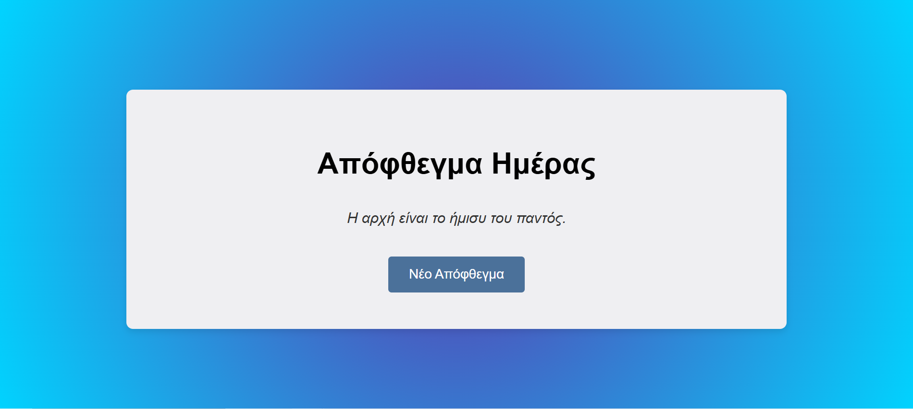

# 🎯 Random Quote Generator

Μια απλή εφαρμογή σε JavaScript που εμφανίζει τυχαία αποφθέγματα με κάθε πάτημα κουμπιού. Σχεδιάστηκε για παρουσίαση σε portfolio.

## ✨ Λειτουργίες
- Εμφανίζει τυχαία αποφθέγματα
- Μοντέρνος responsive σχεδιασμός
- Χρήση μόνο HTML, CSS και JavaScript

## 🔗 Live Demo
Δες το live: [Δες εδώ](http://Jeanne9999.github.io/quote-generator/)

## 📷 Screenshot

## 🛠️ Τεχνολογίες
- HTML5
- CSS3
- JavaScript (Vanilla)

---

### 📁 Δομή
- index.html
- style.css
- script.js
- README.md
- preview.png
- favicon.ico

---

## 📬 Επικοινωνία
Αν θέλετε να συνεργαστούμε ή να σχολιάσετε το έργο, μπορείτε να επικοινωνήσετε μαζί μου μέσω GitHub.
